# Protótipo da Aplicação

### FIGMA:
https://www.figma.com/proto/11A7pSy334rtLXKDZHoeOV/Senac-Gastronomia?node-id=0-1&t=OvSJYkETuhD0isnT-1

### Login
Tela de login onde os usuários podem inserir suas credenciais para acessar o sistema.
- Objetivo: Garantir segurança e autenticação de usuários.

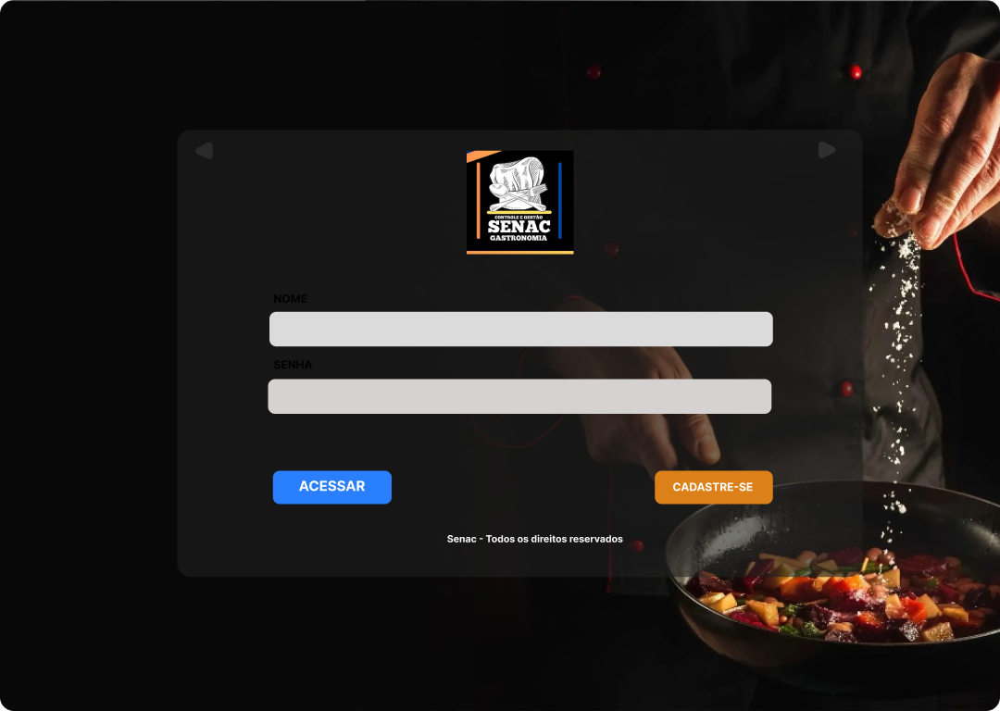

### Cadastro
Tela de cadastro para novos usuários, permitindo a criação de uma conta no sistema.
- Objetivo: Facilitar a entrada de novos usuários no sistema.

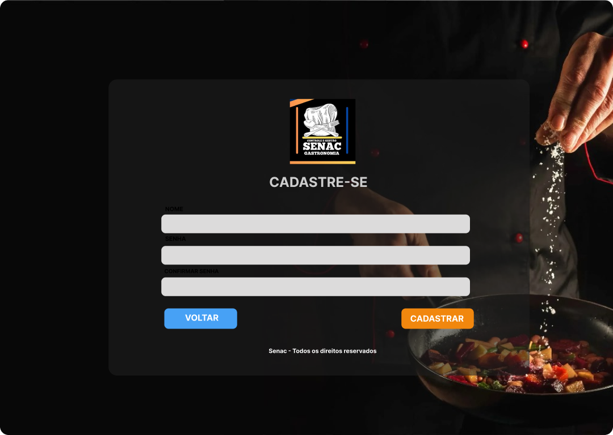

### Escolha
Tela de escolha, área onde o usuário pode selecionar entre diferentes seções do sistema.
- Objetivo: Facilitar a navegação e escolha rápida de ações.

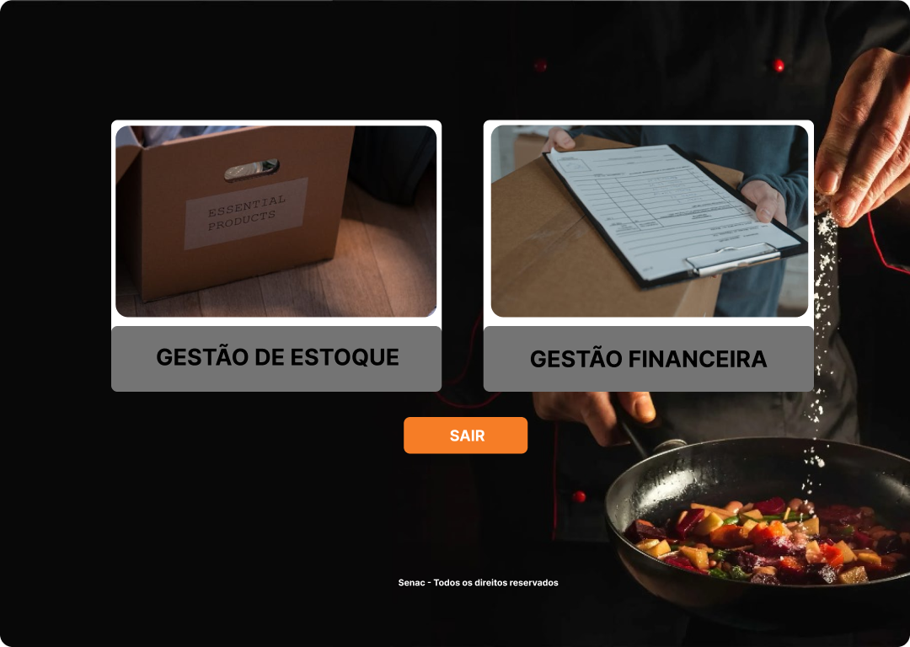

### Home Estoque
Tela inicial do estoque, onde os itens de inventário são exibidos.
- Objetivo: Visualização rápida e acessível do status do estoque.

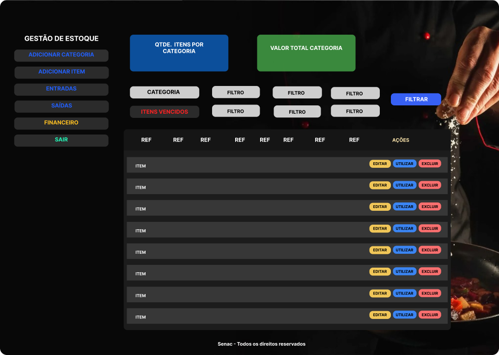

### Adicionar Categoria
Tela para adicionar novas categorias ao sistema de estoque.
- Objetivo: Organizar melhor o inventário por categorias, facilitando a busca e o controle.

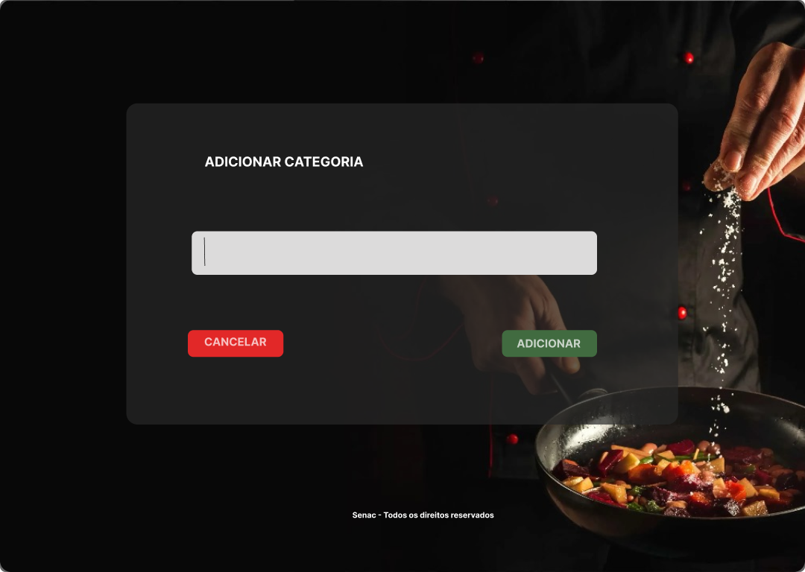

### Adicionar Alimento
Tela para adicionar um novo item alimentar ao sistema de estoque.
- Objetivo: Gerenciar e atualizar o inventário de alimentos de forma eficiente.

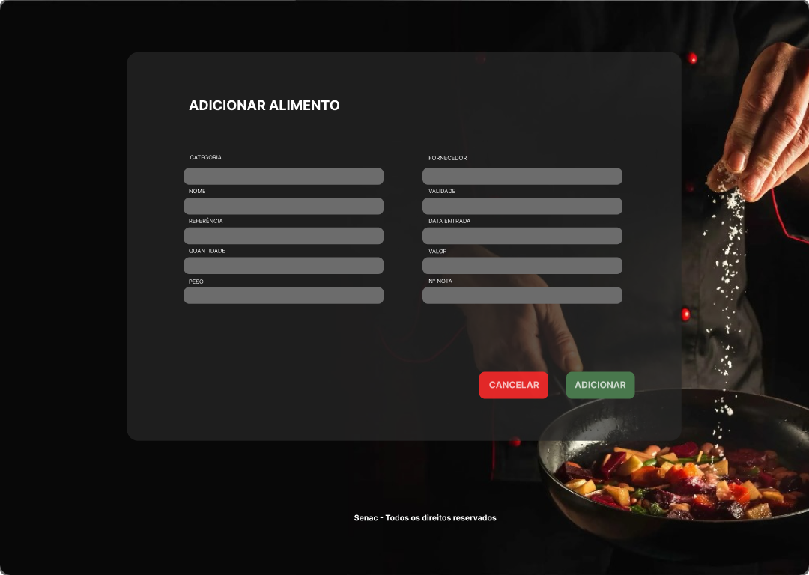

### Editar Alimento
Tela para editar os detalhes de um alimento já registrado no estoque.
- Objetivo: Atualizar informações de produtos, mantendo o controle sempre atualizado.

### Utilizar Alimento (modal)
Tela para registrar a utilização de um alimento do estoque, diminuindo a quantidade disponível.
- Objetivo: Rastrear a saída de produtos e manter o estoque sempre em dia.

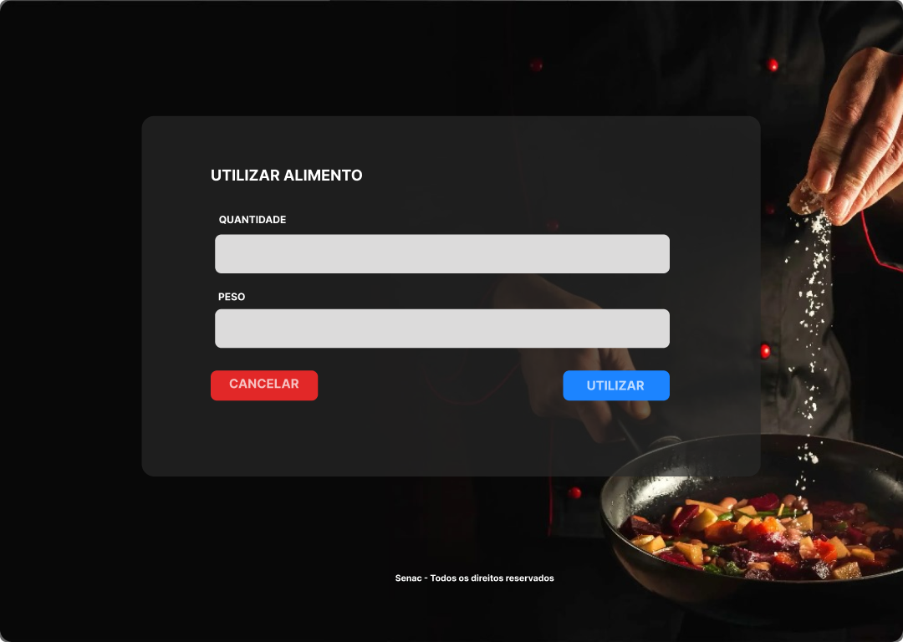

### Tela (modal) de Exclusão
Tela para excluir um item ou categoria do sistema de estoque.
- Objetivo: Facilitar a remoção de itens desnecessários ou inválidos.

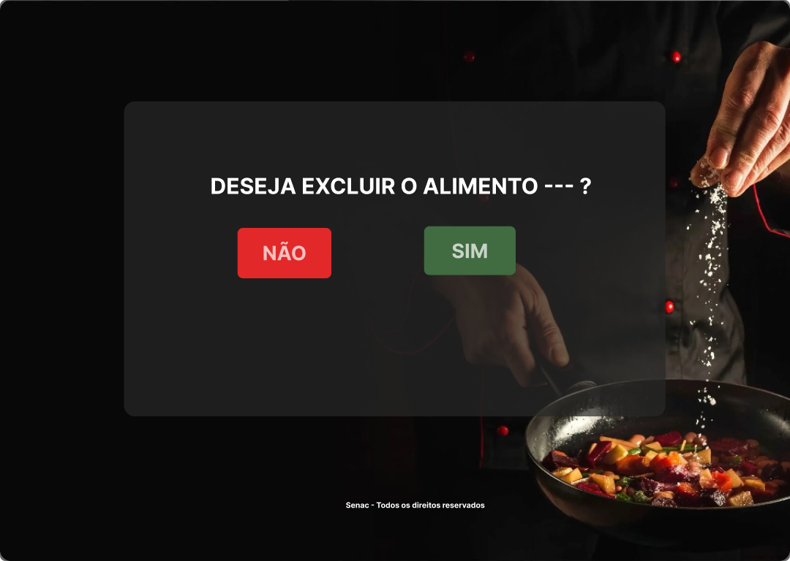

### Entradas
Tela de registro de entradas de produtos no estoque.
- Objetivo: Controlar e registrar as entradas de alimentos de forma precisa.

### Saídas
Tela para registrar a saída de produtos do estoque, por exemplo, quando alimentos são usados ou vendidos.
- Objetivo: Rastrear a saída dos produtos para garantir que o estoque seja mantido corretamente.

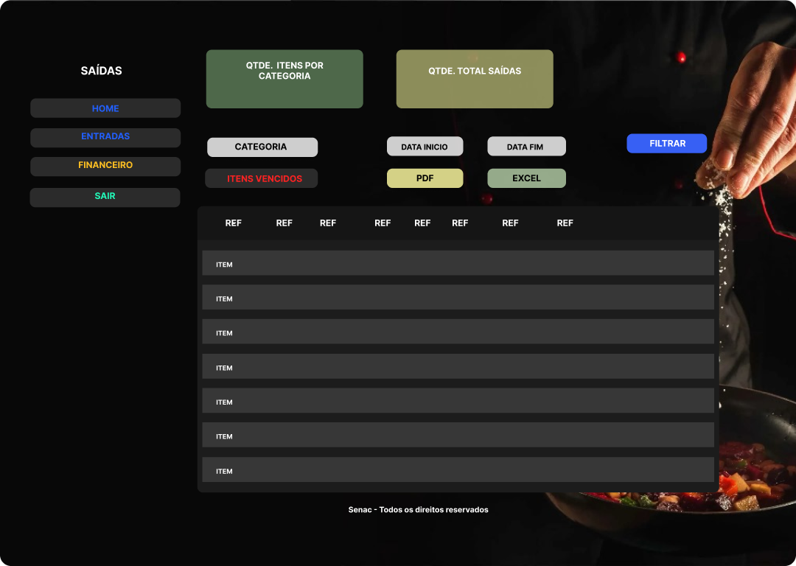

### Itens Vencidos
Tela que exibe os itens vencidos no estoque, ajudando a identificar alimentos que precisam ser descartados.
- Objetivo: Minimizar desperdícios e garantir a qualidade do estoque.

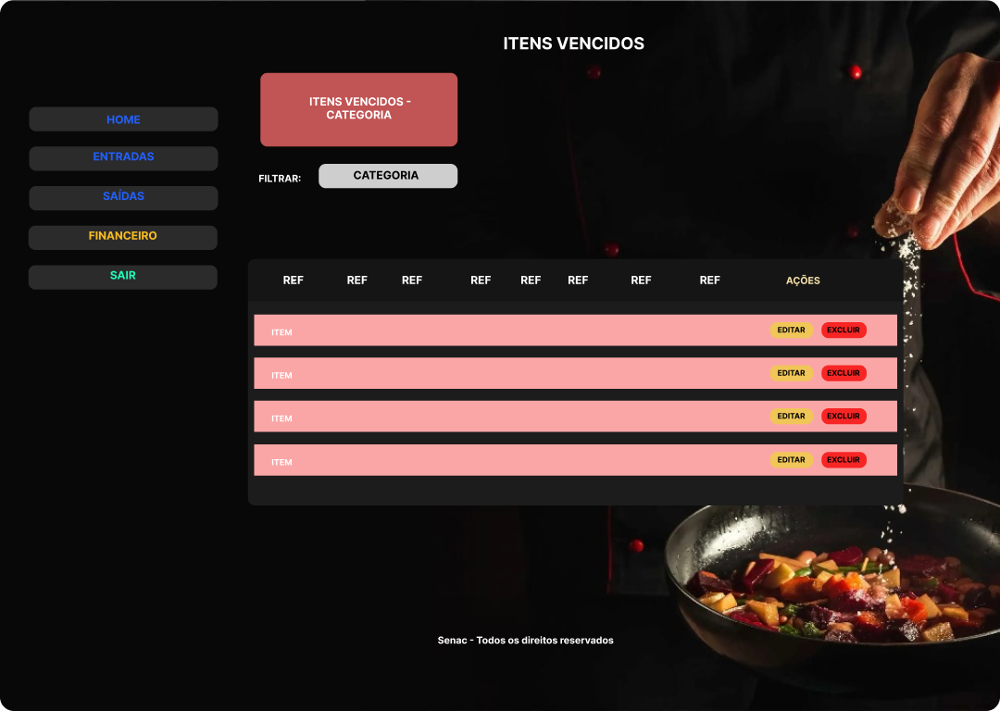

### Home Financeiro
Tela inicial para o controle financeiro, mostra uma visão geral de entradas e saídas de valores.
- Objetivo: Ajudar a gerenciar as finanças da operação de forma eficiente.

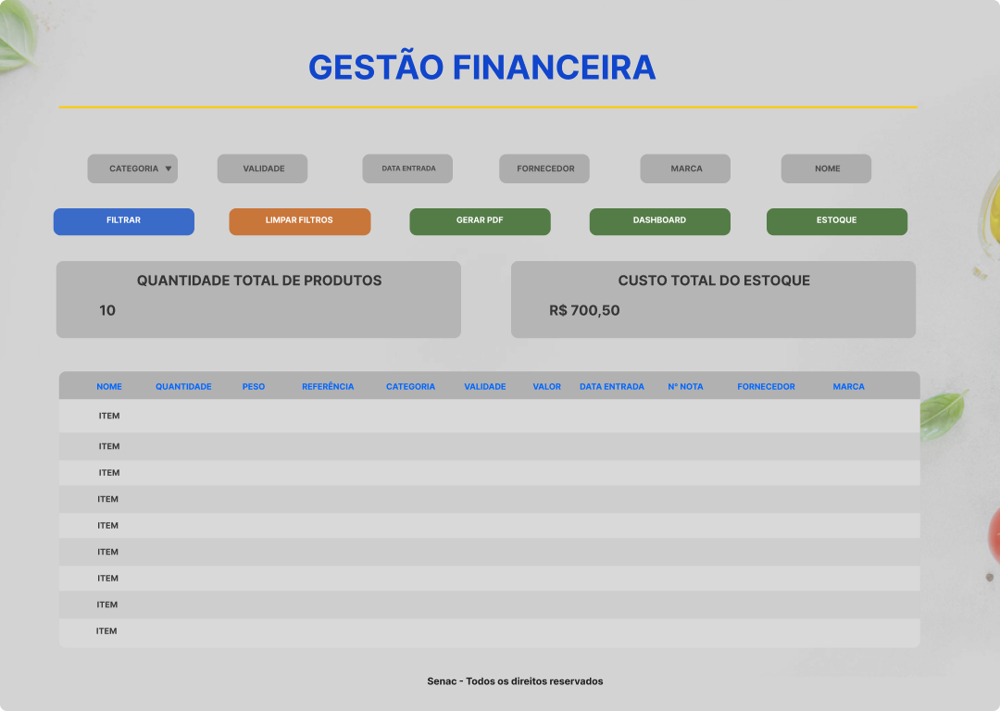

### Dashboard
Tela de dashboard, exibe gráficos e métricas importantes sobre o estoque e as finanças.
- Objetivo: Visão clara e de fácil acesso sobre o estado geral do sistema financeiro.

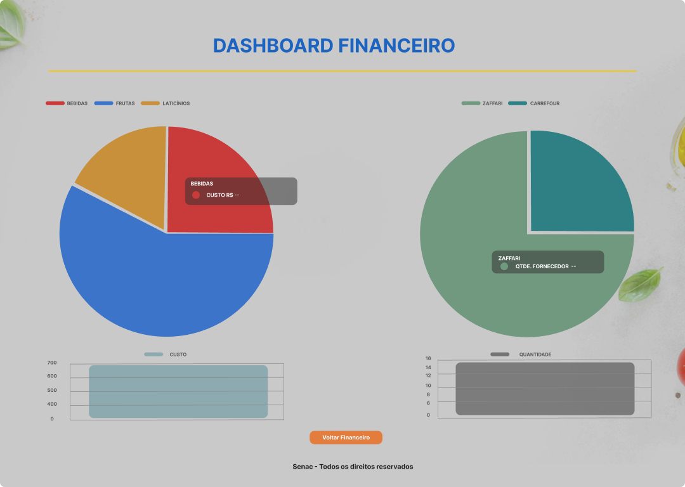

### PDF
Recurso para gerar relatórios em PDF, dados financeiros.
- Objetivo: Permitir a exportação de dados para relatórios e análises externas.

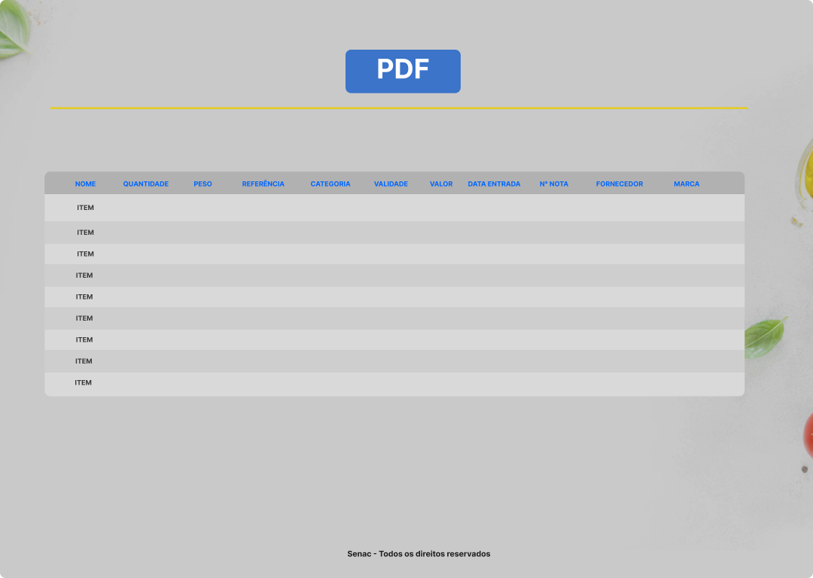

