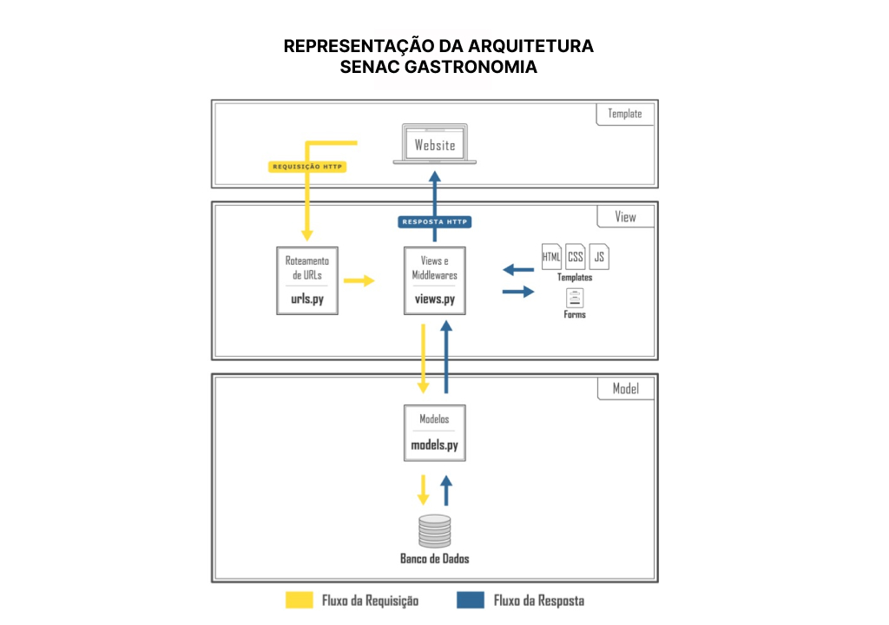
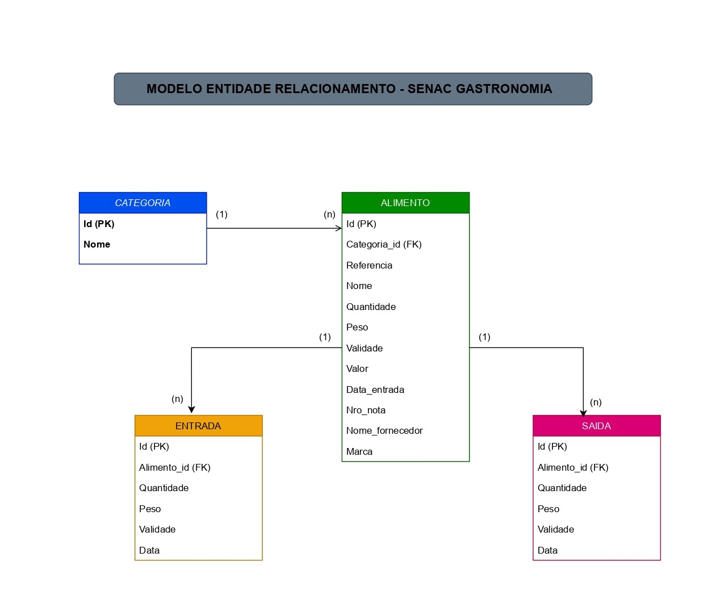

# Representação da Arquitetura

Este projeto, desenvolvido em Python com o framework Django, propõe uma solução prática e escalável ao UniSenac para monitorar entradas, saídas, itens vencidos e categorizar alimentos, oferecendo uma visão clara e organizada do estoque.

### Modelagem do Banco de Dados

A modelagem é centrada em cinco entidades principais:

- Alimento: Representa os itens do estoque, com atributos como nome, referência, categoria, quantidade, peso, validade, fornecedor e valor.

- Categoria: Classifica os alimentos, como “Frios”, “Grãos”, ou “Bebidas”.

- Entrada: Registro histórico de alimentos adicionados ao estoque, incluindo quantidade, peso e validade.

- Saída: Registro histórico de alimentos retirados do estoque, com informações detalhadas sobre quantidade e peso.

- Autenticação: Gerenciado pelo sistema de autenticação do Django, com permissões de acesso.

### Regras de Apresentação

As views são organizadas de forma modular:

- AlimentoListView: Apresenta os itens do estoque, com filtros dinâmicos para categorias, nome, marca e fornecedor.

- AlimentoCreateView e UpdateView: Permitem adicionar e atualizar itens, incluindo lógica para registro de entradas.

- ItensVencidosView: Lista alimentos vencidos, com totalizações por categoria.

- EntradasListView e SaidasListView: Mostram o histórico detalhado de movimentações do estoque.

- UtilizarAlimentoView: Gerencia saídas, reduzindo a quantidade e peso dos alimentos no estoque.

### Camada de Apresentação (Frontend)
A interface foi desenvolvida utilizando Bootstrap 5, oferecendo:

- Formulários dinâmicos com validação.

- Layout responsivo para acesso em dispositivos móveis.

- Mensagens de notificação, como alertas para itens vencidos.

### Persistência e Escalabilidade

O sistema utiliza SQLite 3 e PostgreSQL como banco de dados, garantindo performance e suporte para consultas complexas.

### Fluxo de Dados
O usuário insere um alimento ou registra uma saída.

As regras de negócio validam as ações e atualizam o banco de dados.

As views retornam dados filtrados para os templates.

O usuário é notificado de ações bem-sucedidas ou problemas, como itens vencidos.

### Diferenciais da Arquitetura
- Automação de Processos: Entradas e saídas são registradas automaticamente, evitando erros manuais.

- Notificações Proativas: Alertas para vencimentos e status do estoque.

- Foco na Usabilidade: Filtros por categoria, pesquisa avançada e paginação tornam o sistema prático para usuários finais.

