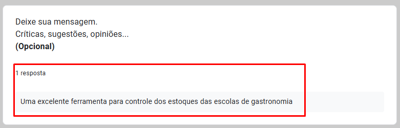

# Testes e Validação

O projeto foi apresentado ao sr. Leonir Martello, gestor do curso de gastronomia do UniSenac.

Após os testes realizados de todas as funcionalidades do projeto, Leonir respondeu a um questionário no qual gerou o feedback do software desenvolvido.

Seguem os itens do formulário e as respostas que melhor atendem na visão do entrevistado:

